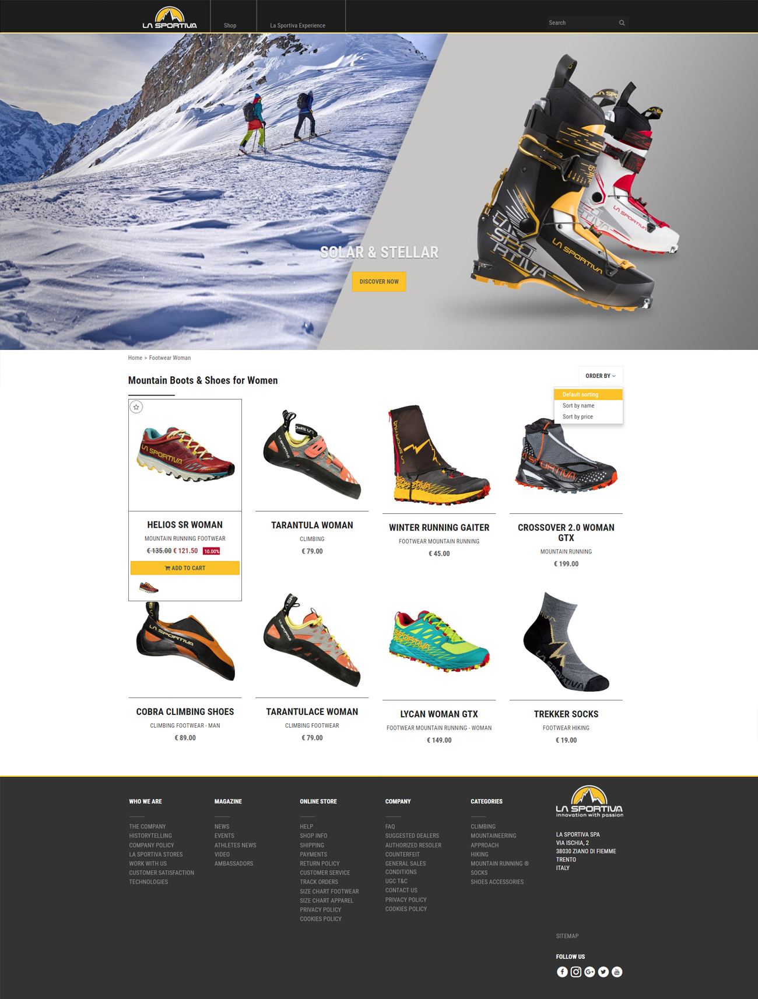

# Zerogrey Front-end Test

The goal of this exercise is to access the knowledge of the most common Front-end skills like HTML, CSS, JavaScript, API consumption.
We evaluate your code in all those aspects as well as the code style, the attention to details and the way you approach the test and the problems you face while developing it.
Feel free to leave comments explaining your decisions and to use any tool or frameworks of your choice.

## The test

1. Based on the provided mockup of the desktop version of the website build a responsive page that works and looks fine on Mobile, Tablet and Desktop.
1. When rendering the page use the Products API entry point to load the products.
1. Implement the search feature using the Search API entry point.

## Extras
We welcome any extra functionality, be creative. Some suggestions:
1. Use local JS cache for API calls to prevent network usage;
1. Use CSS/JS transitions to make UI/UX smoother;
1. Add a share search functionality by providing unique URLs to each search;

## API
Products entry point: http://interviews-env.b8amvayt6w.eu-west-1.elasticbeanstalk.com/products
Search entry point: http://interviews-env.b8amvayt6w.eu-west-1.elasticbeanstalk.com/products?search=<search_term>